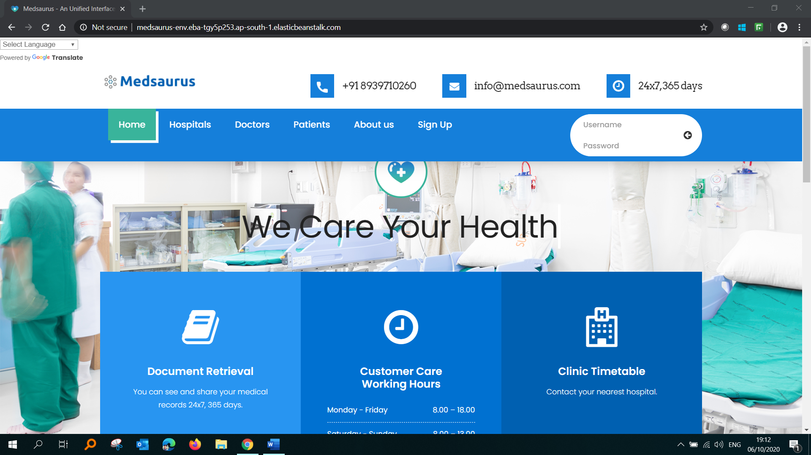
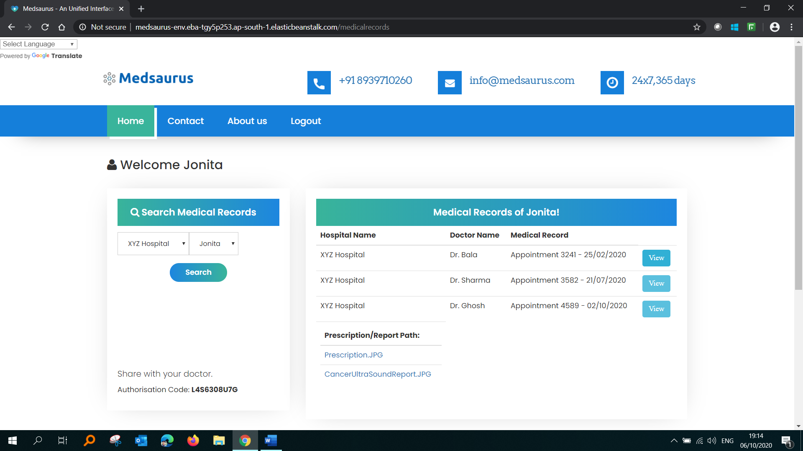
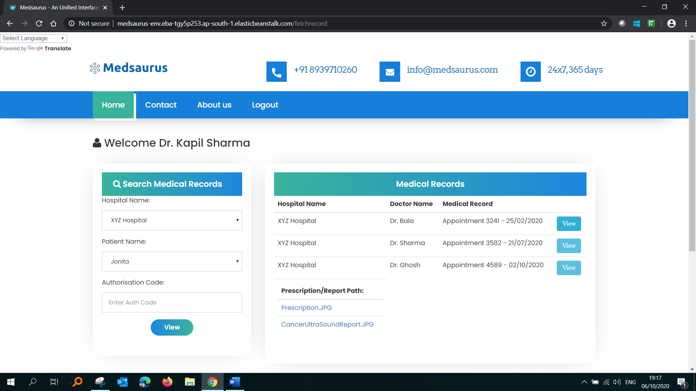
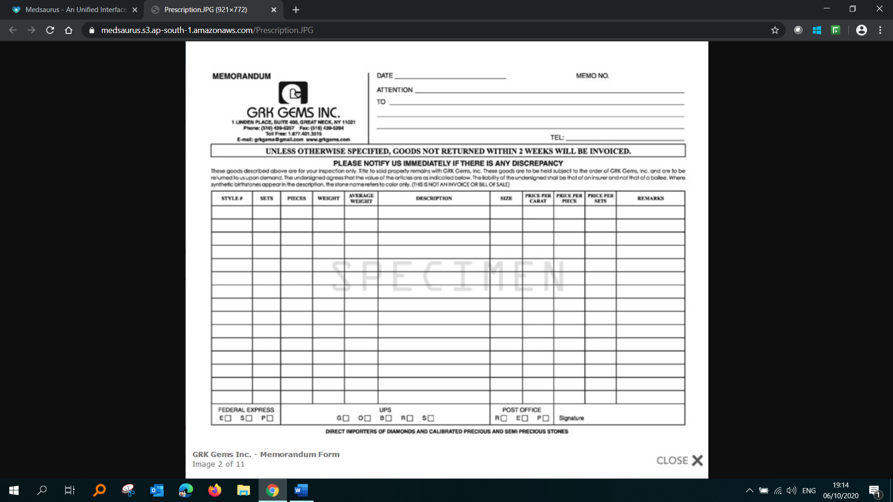
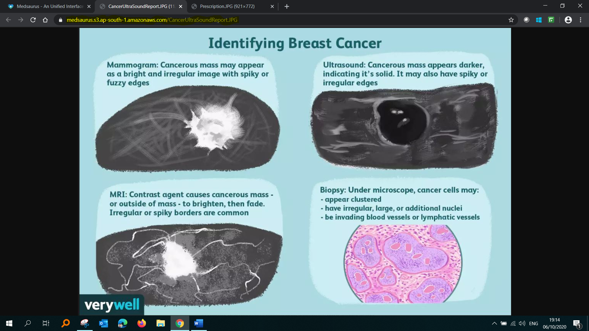
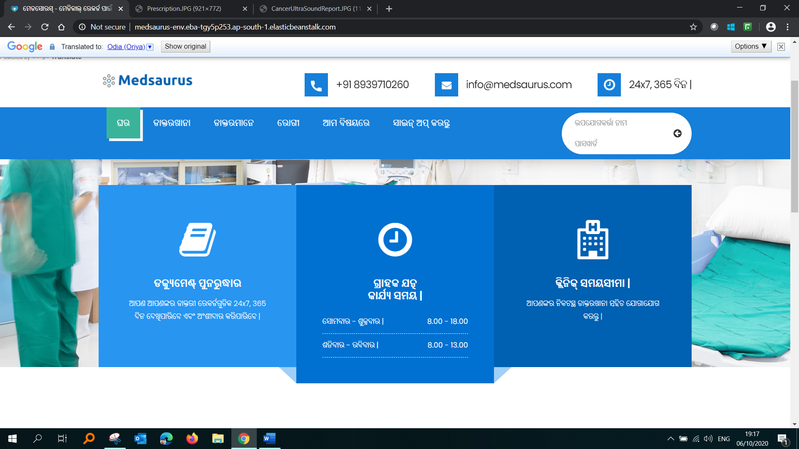
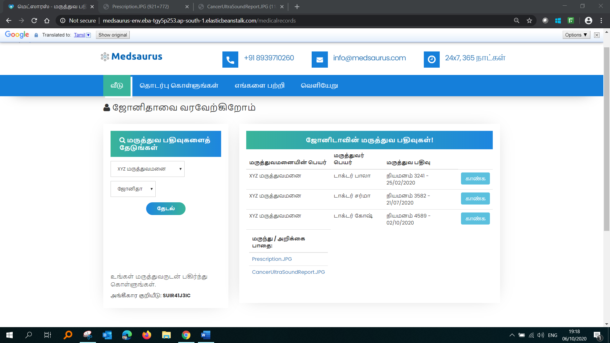

# HolmesSquad - Medsaurus (Proof of concept)
Medsaurus is an unified interface for medical records with an end point service to extract data from EMR of hospitals and with a provision of manual upload by the hospital and the patient to keep all the medical history.

The medical history can be shared by patient to their doctor with ease using a time bound authorization enabling data security and privacy.

This will provide a transition from provider-centred care delivery model to patient-driven care delivery model.

The interface can be used from both web and mobile and in local Indian and many foreign languages.

##How to run and test the project
1. Clone the project
2. ```mvnw spring-boot:run```

##Home Page


##Patient's Page


##Doctor's Page


##Report




##Home page in local language


